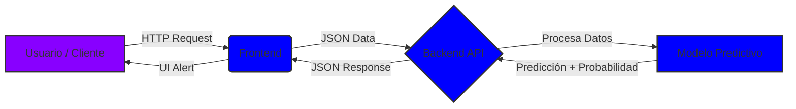

# FlightOnTime_H12-25-L-Equipo-75
Repositorio Principal del proyecto, de acá se desprende información de los repositorios hijos  y cada capa de arquitectura..


# ✈️ Flight On Time


> **Solución predictiva de retrasos aéreos basada en Machine Learning.**

## 📑 Tabla de Contenidos
1. [El Equipo (Team 75)](#-nuestro-equipo-h12-25-l-equipo-75)
2. [Descripción del Proyecto](#-descripción-del-proyecto)
3. [Ecosistema de Repositorios](#-ecosistema-de-repositorios-links-oficiales)
4. [Arquitectura del Sistema](#-arquitectura-del-sistema)
5. [Stack Tecnológico](#-stack-tecnológico)
6. [Contrato de API](#-contrato-de-api)

---

## 👥 Nuestro Equipo (H12-25-L-Equipo 75)

Somos un equipo multidisciplinario de 10 talentos uniendo fuerzas en la simulación laboral de **NoCountry**.

| Rol | Miembro del Equipo | Github / Contacto |
| :--- | :--- | :--- |
| **Frontend** | **Educhile1** (Lead FE) | [@educhile1](https://github.com/educhile1) |
| **Backend** | **Malvadoyael** (Lead BE) | [@Malvadoyael](https://github.com/Malvadoyael) |
| **Backend** | **Educhile1** (Lead BE) | [@educhile1](https://github.com/educhile1) |
| **Data Science** | **JAG-91** (Lead DS) | [@JAG-91](https://github.com/JAG-91) |
| **Data Science** | **franksilva1** | [franksilva1](https://github.com/franksilva1)] |
| **Data Science** | **Educhile1**  | [@educhile1](https://github.com/educhile1) |


---

## 🚀 Descripción del Proyecto

**Flight On Time** es una herramienta diseñada para mitigar la incertidumbre en la aviación civil. Los retrasos en vuelos generan pérdidas millonarias a las aerolíneas y frustración en los pasajeros, perdidas para las empresas de seguro y tarjetas de crédito por concepto de uso de polizas de retraso.

Nuestra solución utiliza datos históricos y algoritmos de **Machine Learning** para estimar la probabilidad de que un vuelo específico sufra retrasos, permitiendo:
* **A los pasajeros:** Recibir alertas preventivas.
* **A las aerolíneas:** Optimizar la logística y reducir costos operativos.
* **A los aeropuertos:** Gestionar mejor la infraestructura en tiempo real.
* **A las empresas de seguro y/o tarjetas de créditos:** Poder calcular la probabilidad de ejecución de una poliza por retraso en vuelo en tiempo real.

### Objetivo del MVP
Desarrollar un sistema capaz de recibir los datos de un vuelo futuro y clasificarlo binariamente como **Puntual** o **Retrasado**, entregando además un porcentaje de probabilidad.

---

## 🔗 Ecosistema de Repositorios (Links Oficiales)

Este proyecto está modularizado en tres componentes principales. Acceda al código fuente de cada área aquí:

| Componente | Descripción Técnica | Link al Repositorio |
| :--- | :--- | :--- |
| **Frontend** | Interfaz Web React/JS para consulta de vuelos. | [📂 **Ir al Repositorio Frontend**](https://github.com/educhile1/frontend_flightontime) |
| **Backend** | API REST en Java Spring Boot + Documentación. | [📂 **Ir al Repositorio Backend**](https://github.com/Malvadoyael/flightontime-backend) |
| **Data Science** | Notebooks, EDA y modelos serializados (Python). | [📂 **Ir al Repositorio Data Science**](https://github.com/JAG-91/Flights-on-time) |

---

## 🏗 Arquitectura del Sistema

El flujo de información viaja desde la consulta del usuario hasta el modelo predictivo y regresa con la estimación.



---

## 🛠 Stack Tecnológico

### 🧠 Data Science & AI
* **Lenguaje:** Python
* **Librerías:** Pandas (Limpieza de datos), Scikit-learn (Modelado).
* **Entregable:** Modelo serializado (`joblib`/`pickle`) y Notebooks de EDA.
* **Scope:** Clasificación binaria (0 = Puntual, 1 = Retrasado).

### ⚙️ Backend
* **Lenguaje:** Java 17+
* **Framework:** Spring Boot.
* **Comunicación:** API RESTful.
* **Funciones:** Validación de datos, integración con el modelo ML, manejo de errores estandarizados.

### 💻 Frontend
* **Tecnología:** HTML5 / CSS3 / JavaScript (React/Angular según aplique).
* **Conexión:** Consumo de endpoint `/predict` para visualización de resultados.

---

## 🔌 Contrato de API

El núcleo de la integración entre nuestros servicios se basa en el siguiente contrato JSON para el endpoint `/predict`.

**Endpoint:** `POST /predict`

### Ejemplo de Petición (Request)
```json
{
  "aerolinea": "AZ",
  "origen": "GIG",
  "destino": "GRU",
  "fecha_partida": "2025-11-10T14:30:00",
  "distancia_km": 350
}
```

### Ejemplo de Respuesta (Response)
```json
{
  "prevision": "Retrasado",
  "probabilidad": 0.78
}
```

---
Proyecto desarrollado para el Hackathon de NoCountry - 2025
